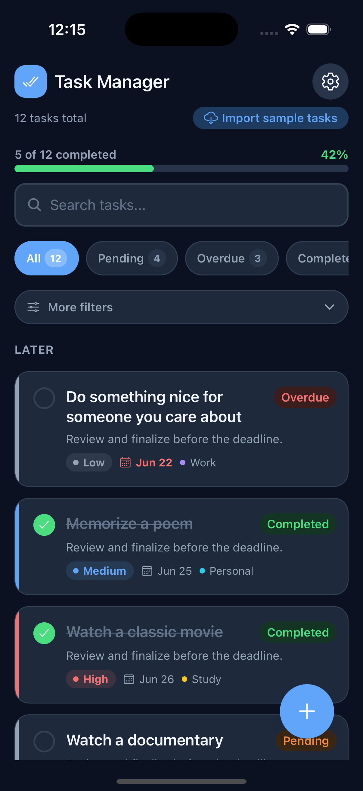
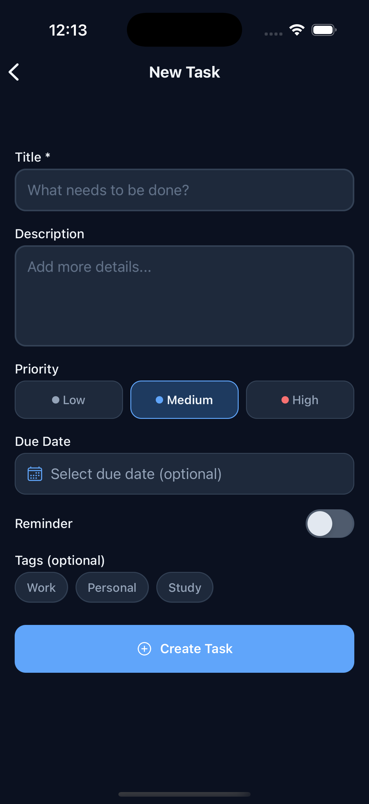
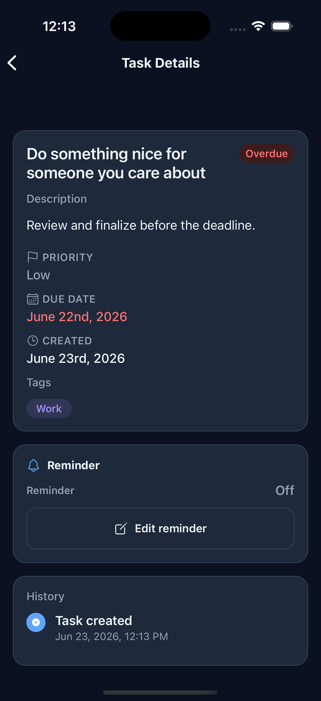
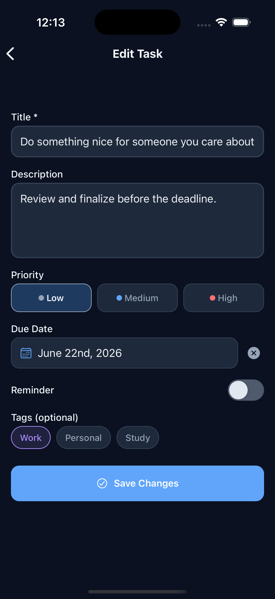
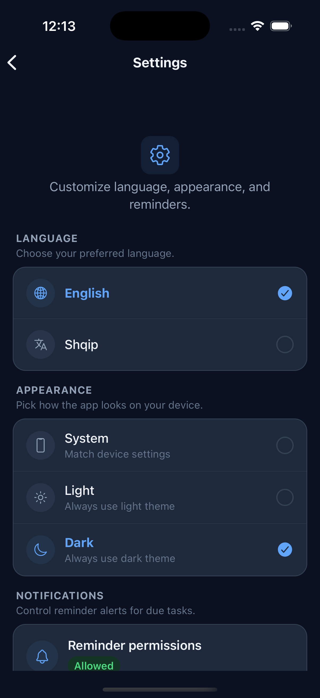
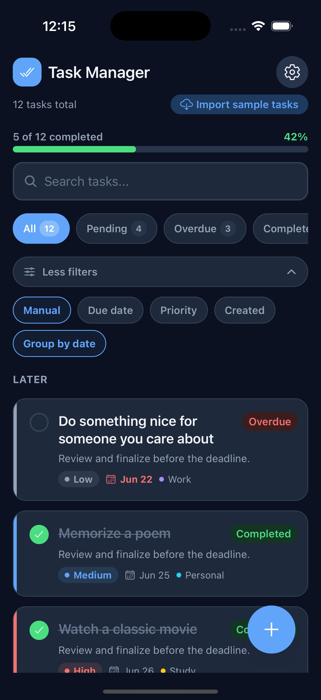
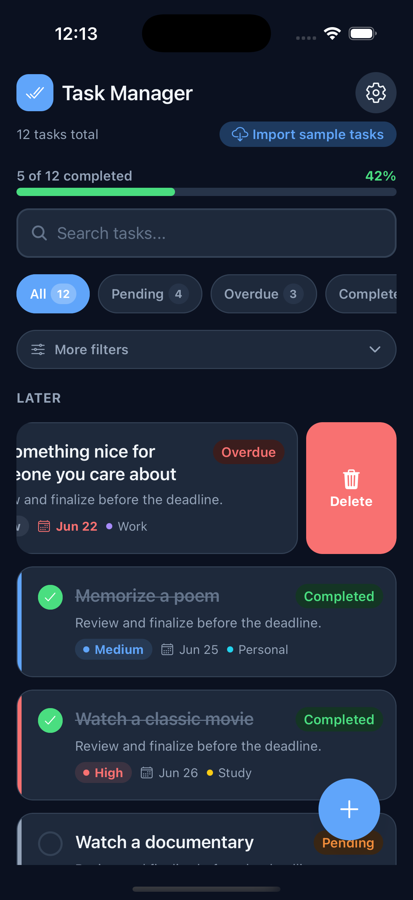
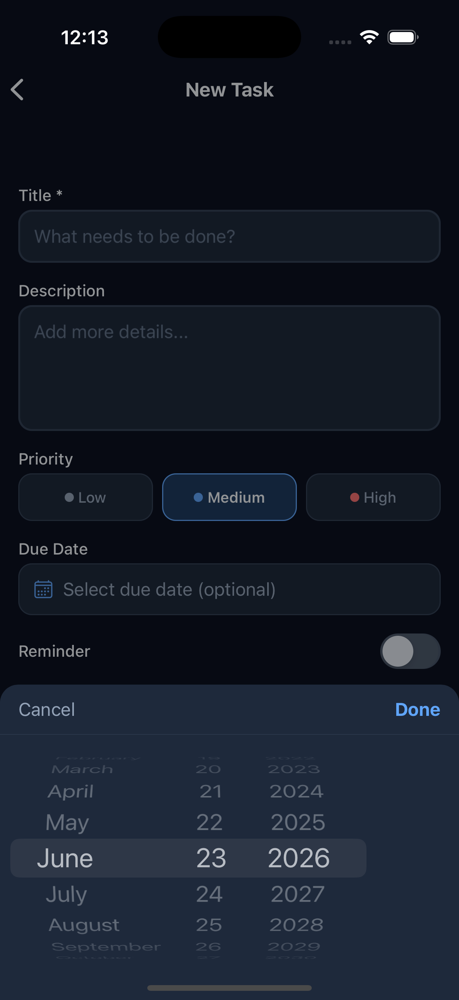
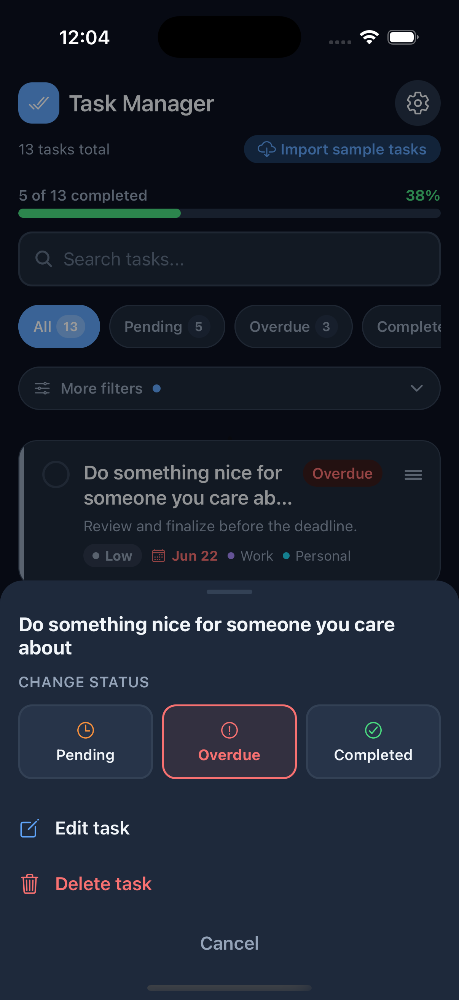
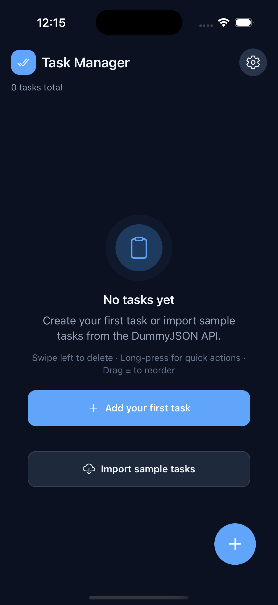

# Task Manager — PRITECH React Native Technical Task

A production-style task manager built with **React Native (Expo SDK 54)** and **TypeScript**. Users can create, view, complete, and delete tasks, with search, filtering, sorting, grouping, local persistence, optional due-date reminders, and sample data from a public API.

> Built for the PRITECH React Native technical task — clean architecture, reusable UI, clear UX, and solid logic without unnecessary complexity.

---

## Features

### Core requirements

| Feature | Implementation |
| ------- | -------------- |
| Task list | Status, priority, due date, and tags on each card |
| Add task | Title, description, priority, due date, tags, optional reminder |
| Complete / reopen | Checkbox on card or detail screen |
| Delete | Swipe left, quick actions, or detail screen |
| Task details | Full task view with history and reminder info |
| Validation | Zod + React Hook Form with inline errors |
| Clean UI | Shared design tokens (colors, spacing, typography, radius, shadows) |
| Public API | Sample import from [DummyJSON Todos API](https://dummyjson.com/todos) |

### Bonus requirements

- **Search** — title, description, or tag
- **Filter** — All / Pending / Overdue / Completed with live counts
- **Persistence** — Zustand + AsyncStorage (tasks survive restarts)
- **Navigation** — Expo Router file-based routing

### Extra polish

| Area | Details |
| ---- | ------- |
| **Toasts** | Create, edit, import, status change, delete — with **5s Undo** on delete |
| **Quick actions** | Long-press a card → change status, edit, delete (animated sheet) |
| **Gestures** | Swipe to delete · drag **≡** to reorder · FAB hides on scroll |
| **Sort & group** | Manual / due date / priority / created; Today / Tomorrow / Later / No date |
| **More filters** | Sort & grouping collapsed by default behind a toggle |
| **Settings** | Language (EN/SQ), theme (system/light/dark), notification permissions |
| **Reminders** | Local on-device notifications on due date + chosen time |
| **i18n** | English & Albanian, device language detection |
| **Dark mode** | Persisted preference, theme-aware components (incl. switches) |
| **Empty states** | Gesture hints when empty; clear search/filters when no matches |
| **Error boundary** | Friendly fallback if the app crashes |
| **Tests** | Jest for store, filters, sorting, grouping, toast, status, API mapping |

---

## Screens

| Route | Screen |
| ----- | ------ |
| `/` | Task list (search, filters, progress, import) |
| `/task/create` | New task form |
| `/task/[id]` | Task details + history |
| `/task/edit/[id]` | Edit task |
| `/settings` | Language, appearance, notifications |

---

## Gestures & interactions

| Action | How |
| ------ | --- |
| Complete / reopen | Tap checkbox on card |
| Open details | Tap card body |
| Quick actions | Long-press card |
| Delete | Swipe left → toast with Undo |
| Reorder | Drag **≡** handle (Manual sort, grouping off, no search/filter) |
| Sort / group | Tap **More filters** on the list |
| Add task | Tap floating **+** button |
| Settings | Tap **⚙️** in the list header |

---

## Tech stack

| Concern | Choice |
| ------- | ------ |
| Framework | Expo SDK 54, React Native 0.81, React 19 |
| Language | TypeScript (strict) |
| Navigation | Expo Router |
| Local state | Zustand + AsyncStorage |
| Server state | TanStack Query v5 |
| Forms | React Hook Form + Zod |
| i18n | i18next + expo-localization |
| Gestures | gesture-handler, Reanimated, draggable-flatlist |
| Notifications | expo-notifications (local only) |
| Dates | date-fns |
| Testing | Jest + jest-expo |
| Tooling | ESLint + Prettier |

---

## Getting started

### Prerequisites

- Node.js 18+ and npm
- [Expo Go](https://expo.dev/go) on a device, or iOS Simulator / Android Emulator

### Install & run

```bash
npm install
npm start          # Expo dev server — scan QR with Expo Go
npm run ios        # iOS Simulator
npm run android    # Android Emulator
npm run web        # Browser
```

### Quality checks

```bash
npm run typecheck
npm run lint
npm run format
npm test
```

### Expo Go on a physical device

This project targets **Expo SDK 54** so it opens in **Expo Go** via QR scan without a dev build.

It was scaffolded on SDK 56 first, then downgraded to **SDK 54** because Expo Go on phones often lags behind the newest SDK. All features work the same; only the underlying Expo/RN versions differ.

1. Install/update **Expo Go** (must support SDK 54).
2. Phone and computer on the **same Wi‑Fi**.
3. Run `npm start` and scan the QR code.

If you see *"Project is incompatible with this version of Expo Go"*, update Expo Go or use a simulator / [development build](https://docs.expo.dev/develop/development-builds/introduction/).

---

## Project structure

```
app/
  _layout.tsx           # Root layout, providers, stack navigation
  index.tsx             # Task list
  settings.tsx          # Settings
  task/create.tsx       # Create task
  task/[id].tsx         # Task details
  task/edit/[id].tsx    # Edit task

src/
  components/
    ErrorBoundary.tsx
    ui/                 # Button, Toast, EmptyState, AppSwitch, DateTimePickerModal, ...
  features/
    tasks/
      api/              # DummyJSON client
      components/     # TaskCard, TaskFilters, TaskListSortBar, QuickActions, ...
      hooks/            # Import, delete-with-undo, refresh, filters
      schemas/          # Zod schemas
      store/            # Zustand store + tests
      types/
      utils/            # Status, sort, group, API mapping + tests
    settings/
      components/       # Language, theme picker, notification row, section cards
      store/
  i18n/                 # en + sq locales
  lib/                  # Notifications, toast, haptics, deep links, query client
  providers/
  theme/
```

---

## Data model

| Field | Type | Notes |
| ----- | ---- | ----- |
| `id` | `string` | UUID |
| `title` | `string` | Required |
| `description` | `string` | Optional |
| `status` | `'pending' \| 'completed'` | Stored status |
| `priority` | `'low' \| 'medium' \| 'high'` | |
| `dueDate` | `string \| null` | ISO date (`yyyy-MM-dd`) |
| `reminderEnabled` | `boolean` | Local notification toggle |
| `reminderTime` | `string \| null` | `HH:mm` when reminder is on |
| `tags` | `('work' \| 'personal' \| 'study')[]` | Optional |
| `createdAt` | `string` | ISO timestamp |
| `history` | `TaskHistoryEntry[]` | Created / edited / completed / reopened |

**Display status** is derived: a pending task with `dueDate` in the past shows as **Overdue** (not stored separately).

---

## Reminders & notifications

- **Local only** — no Firebase, no push server, no backend.
- User picks due date + reminder time on the task form.
- Permission is requested once on first launch (can be changed in **Settings → Notifications**).
- Tapping a notification opens the related task (deep link via `expo-router`).
- In **Expo Go**, the OS permission dialog applies to the Expo Go app — that is expected.

---

## Public API

```
GET https://dummyjson.com/todos?limit=12
```

Todos are mapped to the app's `Task` model in `src/features/tasks/utils/mapApiTodoToTask.ts` (priority, due date, tags, description), then merged into the local store. Success and errors are shown as **toasts**, not alerts.

---

## Testing

| Module | Coverage |
| ------ | -------- |
| `taskStatus` | Overdue detection, display status |
| `mapApiTodoToTask` | API → domain mapping |
| `taskStore` | CRUD, restore, `setTaskDisplayStatus`, filters |
| `taskListUtils` | Sorting, date grouping |
| `toastStore` | Show, hide, undo action |

```bash
npm test
```

---

## Design decisions

- **Zustand** — simple persisted local state without Redux boilerplate.
- **TanStack Query** — proper loading/error handling for API import.
- **Derived overdue** — always correct without background jobs.
- **Toast over Alert** — less disruptive for success/info; delete from quick actions/detail still confirms first.
- **Collapsible sort filters** — keeps the list header clean; status filters stay visible.
- **Drag via ≡ handle** — avoids conflicting with long-press quick actions.
- **SDK 54** — trade-off for easy Expo Go testing during review and demos.

---

## Screenshots

| Task list | New task | Task detail |
| :---: | :---: | :---: |
|  |  |  |

| Edit task | Settings | More filters |
| :---: | :---: | :---: |
|  |  |  |

| Swipe delete | Date picker | Quick actions |
| :---: | :---: | :---: |
|  |  |  |

| Empty state |
| :---: |
|  |

